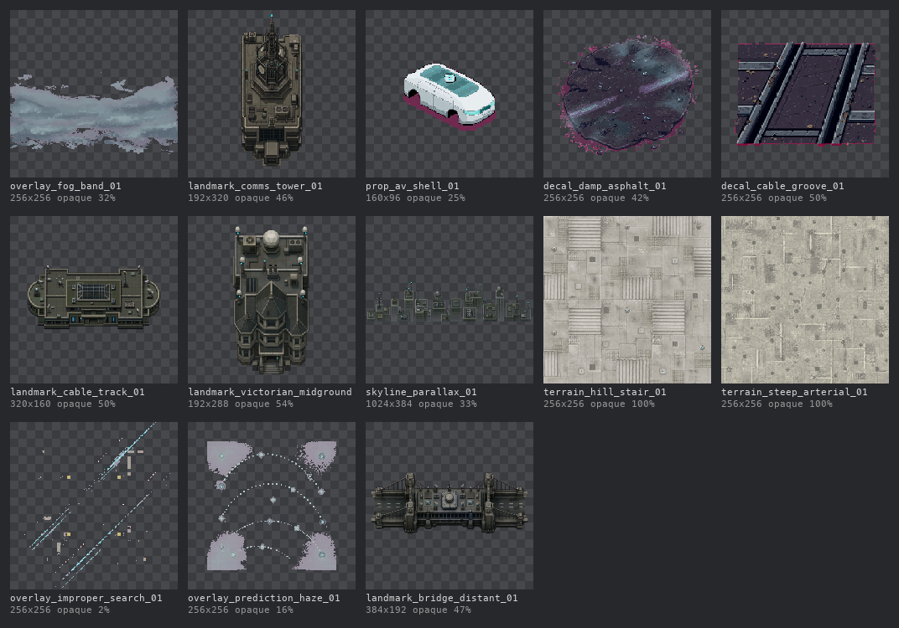

# LC-009 review — the San Francisco legacy candidates

**Decision asked:** the disposition of the 12 `sfCandidate` sprites left open since SS-specs#3 (D-074). Merging records it; closing rejects it.

## The test

`legacy-admission.md` §Bounded visual and audio admission admits a legacy file only when its **runtime role in SS-001 is the same role it had in the legacy build**, with a per-asset record carrying the frozen-commit digest. Since #3 was opened, every declared environment ID except the two fog layers has been filled by a delivered original (T800, D-073). So most candidates no longer have a role to fill.

## Disposition

| Candidate | Proposed | Why |
|---|---|---|
| `overlay_fog_band_01` | **ADMIT (candidate) → `env_fog_low`** | Same role: a fog overlay in legacy, a fog layer in SS-001. Soft band, 32% coverage, mean alpha 81/255. Fills one of the two P0 fog layers T800 records as missing. Condition: drawn under the fog readability floor — never concealing collision, lethal telegraphs, or Camera boundaries (fog-layers intent, `visual-assets.md` §7). Intake still needs the frozen-commit digest and resample. `env_fog_high` stays an original. |
| `prop_av_shell_01` | **DEFER to P1** | Fits P1 "fictional autonomous vehicle". Magenta chroma-key fringe under the body must be removed first. |
| `decal_damp_asphalt_01` | **DEFER to P2** | Fits P2 "rain-darkened material state". Magenta fringe at the edge. |
| `landmark_comms_tower_01` | **REJECT — no role** | A gothic spire building, not the P1 "distant three-pronged tower glyph". No landmark slot in SS-001. |
| `decal_cable_groove_01` | **REJECT — no role** | Cable-car slot track. The rail spine is delivered as an original (`prop_rail_strip`); cable-car shorthand sits next to §15's "arbitrary cable car". Magenta border. |
| `landmark_cable_track_01` | **REJECT — no role** | A building; no landmark slot. |
| `landmark_victorian_midground_01` | **REJECT — no role** | Façades are delivered as the 14 per-solid originals; there is no midground layer. |
| `skyline_parallax_01` | **REJECT — no role** | No skyline or parallax layer is declared in `environmentAssetIds`. |
| `terrain_hill_stair_01` | **REJECT — no role** | Ground roles are filled by delivered originals (`ground_steps`, `ground_sidewalk`). |
| `terrain_steep_arterial_01` | **REJECT — no role** | Ground roles are filled by delivered originals. |
| `overlay_improper_search_01` | **REJECT — no role** | Daemon telegraphs are delivered originals (`telegraph_daemon_*`). |
| `overlay_prediction_haze_01` | **REJECT — no role** | Telegraph and prediction presentation is delivered as originals. |
| `landmark_bridge_distant_01` | **stays REJECTED** | §15 prohibits the Golden Gate Bridge. |

## Totals

1 admit-candidate · 1 defer to P1 · 1 defer to P2 · 9 reject for no SS-001 role · 1 already rejected.

Three candidates carry magenta chroma-key fringe (the autonomous vehicle, damp asphalt, and the cable groove), so none could have been admitted as delivered.
