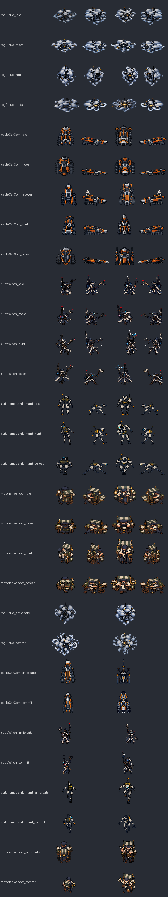
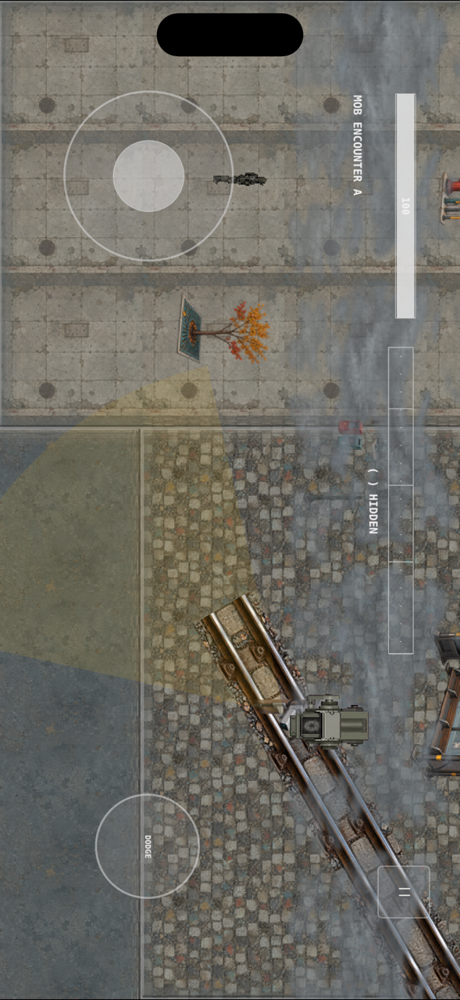

# T602 review — standard-enemy clip families, fog layers, and north/south rework

**Decision asked:** accept the delivered standard-enemy frames and fog tiles (D-076). Merging this PR records the acceptance; closing it rejects.

## What is delivered

| set | frames | was | now |
|---|---:|---|---|
| D-071 standard-enemy clips: `idle`, `move`, `hurt`, `defeat` × 5 enemies (no Informant `move`), plus Correlator `recover` | 368 | `plannedOriginal` | `originalAccepted` |
| Attack clips' `n`/`s` views, redrawn (SS-runtime #89) | 50 | rotated side views | genuine back/front views, re-admitted with new SHA-256 |
| `env_fog_low`, `env_fog_high` (T800) | 2 | `plannedOriginal` | `originalAccepted` |

Every record is `projectOriginal` with SHA-256 in `asset-catalog-001`. Clip-frame coverage is now **956 / 956**: no actor draws a blockout in any clip direction. The only `plannedOriginal` records left are the three boss telegraph sounds (D-075).

The sheet shows the first frame of every clip in `n`, `e`, `s`, `w` order. The last ten rows are the reworked attack clips, which have only `n` and `s`.

In game on SS-runtime `main` (`0ab99b8`) with this delivery admitted: iPhone simulator, autopilot, 30 s. It shows the fog layers in place over the arena at actual scale.

## Checks run

- **`validate_delivery.py`:** 80 / 80 clip directions complete and valid.
  - Each frame: 64 × 64 RGBA, transparent corners, not blank, no magenta.
  - Ground contact on row 56, with drift ≤ 2 px except hurt/defeat and the floating Fog Analytics Cloud.
  - No identical consecutive frames.
  - Fog: 512 × 512, mean alpha ≤ 90, seamless edges.
- **Rework frames:** all 50 are 64 × 64 RGBA, not blank, and have no magenta. None still has the east frame's bounding box transposed, which is the signature of a rotated side view.
- **Palette:** mean saturation and share of strong-orange pixels are within the delivered attack frames' range for each enemy. The Correlator's orange accents are its established palette, not drift.
- **SS-runtime:** `swift test` 467 / 467 and app `xcodebuild test` 19 / 19 with the delivery admitted.

## Not checked here

- **Motion quality in play:** timing and readability of hurt vs defeat at speed. This belongs to the playtest gates (T903/T904), not intake.
- **Fog readability floor in dense combat:** the fog never conceals collision, lethal telegraphs, or Camera boundaries. Mean alpha passes; the combat judgement stays with gate D.
