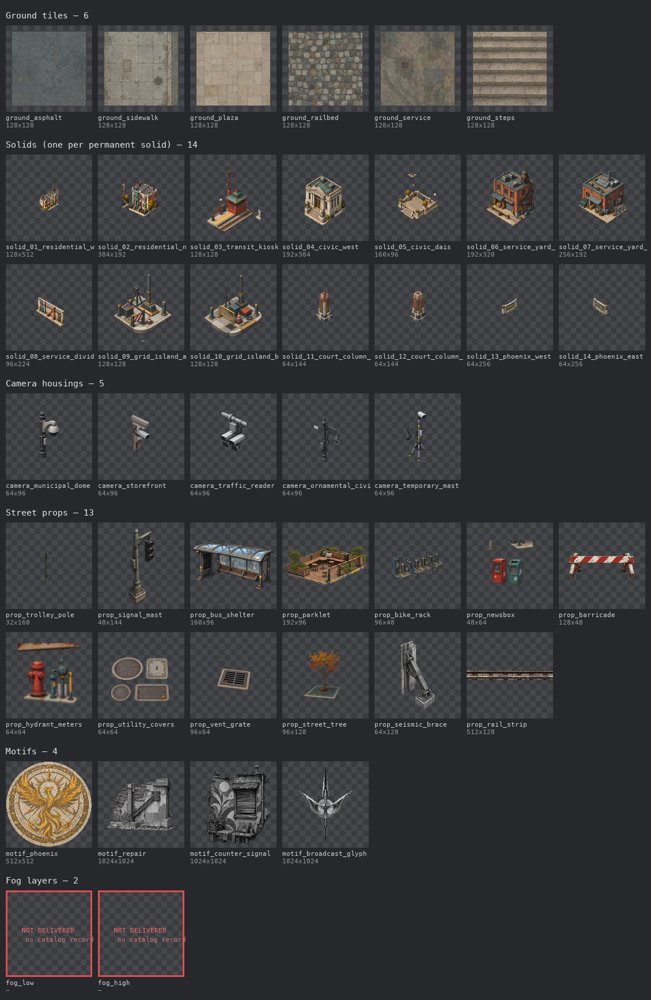
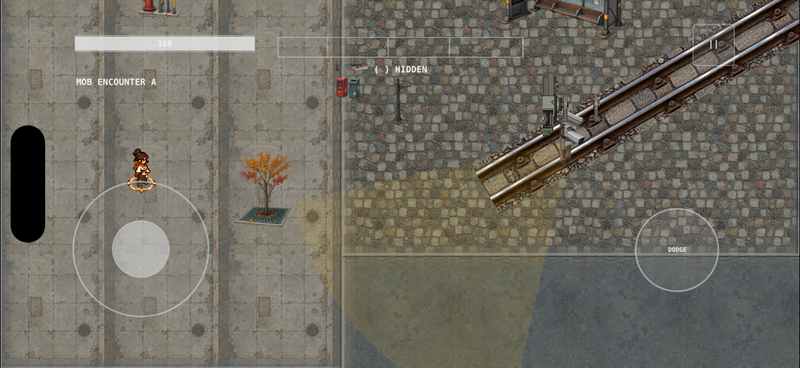

# T800 review — Civic Seam P0 environment

**Decision asked:** approve the delivered P0 environment families (D-073). Merging SS-specs PR for this sheet records the approval; closing it rejects.

## What is delivered

42 of the 44 IDs in `presentation-assets-001` `environmentAssetIds` are delivered and admitted — every one `originalAccepted`, `projectOriginal`, with SHA-256 in `asset-catalog-001`.

Each tile is scaled to fit its cell, so the sheet shows inventory and form, not scale. Scale in play, on current SS-runtime `main` (`e09b36d`), iPhone simulator, autopilot run at 30 s:

## P0 production list against what exists

`visual-assets.md` §14 and `visual-production.md` §10 define P0 more broadly than the ID list:

| P0 family | Delivered | Status |
|---|---|---|
| Diagonal road/rail modules | `ground_railbed`, `prop_rail_strip` | delivered |
| Victorian / Edwardian / Classical façades | 14 `solid_*`, one per permanent solid | delivered as per-solid pieces; modular recombination is T508 |
| Civic Plaza landmark kit | `ground_plaza`, `solid_04_civic_west`, `solid_05_civic_dais` | delivered |
| Six Camera housing families | 5 standard housings | **Captain Camera missing** (T507) |
| Trolley-wire system | `prop_trolley_pole` | **wires not produced**; no asset ID |
| Two-layer fog | — | **`env_fog_low`, `env_fog_high` declared with no catalog record**; runtime fog is off until they land (#78) |
| Core street furniture | 11 props: shelter, parklet, bike rack, newsbox, barricade, hydrant/meters, utility covers, vent grate, tree, signal mast, seismic brace | delivered |
| Detection State materials | — | not an asset; drawn procedurally by the runtime |
| Original phoenix relief | `motif_phoenix`, `solid_13/14_phoenix_*` | delivered |
| Basic rooftop kit | — | **not produced**; no asset ID |

## Notes for the reviewer

- Motifs are 512–1024 px square, far above the 64-unit authoring grid. They scale down in play, but they count against atlas and preload budgets (T505).
- This sheet covers inventory, form, and provenance. The spec's full P0 review also asks for dense-combat and collision review; those belong to gates D and E and are not claimed here.
